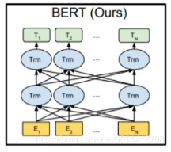

## 大模型基础知识总结

### 1、基础模型总结

#### 1.1、MLP
  
  $$\begin{aligned}z & =\sum_{d=1}^D w_d x_d+b \\&=\boldsymbol{w}^{\top} \boldsymbol{x}+b_{\gamma_1}\end{aligned}$$
  例如上图所示，神经元接收到$$
\boldsymbol{x}=\left[x_1 ; x_2 ; \cdots ; x_D\right]
$$
输入然后输出$$z$$,最后经过非线性激活函数$$\sigma$$得到输出$$\hat{y}$$
$$\hat{y}=\sigma(z)$$
#### 1.2、CNN
  
    - 基本的结构：卷积层，池化层，全连接层
        - 卷积层：卷积核，步长，填充
            卷积核：卷积核的大小，卷积核的个数
            步长：卷积核每次移动的步长
            填充：在输入的四周填充0
        - 池化层：最大池化，平均池化，步长，填充
            最大池化：取池化窗口内的最大值
            平均池化：取池化窗口内的平均值
            步长：池化窗口每次移动的步长
            填充：在输入的四周填充0
        - 全连接层：全连接层就是普通的神经网络层，每个神经元都和前一层的所有神经元相连
    - 卷积核的作用：提取特征
    - 池化层的作用：降维，防止过拟合
    - 全连接层的作用：分类
#### 1.3、RNN
  
  循环神经网络的输入 $x_t$ 与输出 $y_t$
$$
\begin{aligned}
& \boldsymbol{h}_t=f\left(\boldsymbol{U} \boldsymbol{h}_{t-1}+\boldsymbol{W} \boldsymbol{x}_t+\boldsymbol{b}\right) \\
& \boldsymbol{y}_t=\boldsymbol{V} \boldsymbol{h}_t
\end{aligned}
$$
其中$h$为隐状态，$f(.)$表示非线性激活函数，$U、V、b和V$为网络参数

#### 1.4、LSTM

上图展示了 LSTM 网络的循环单元结构, 其计算过程为: 1) 首先利用上一时刻的外部状态 $\boldsymbol{h}_{t-1}$ 和当前时刻的输入 $\boldsymbol{x}_t$, 计算出三个门, 以及候选状态 $\tilde{\boldsymbol{c}}_t ; 2$ )结合遗忘门 $\boldsymbol{f}_t$ 和输入门 $\boldsymbol{i}_t$ 来更新记忆单元 $\left.\boldsymbol{c}_{\boldsymbol{t}} ; 3\right)$ 结合输出门 $\boldsymbol{o}_t$, 将内部状态的信息传递给外部状态 $\boldsymbol{h}_t$.
(1) 遗忘门 $\boldsymbol{f}_t$ 控制上一个时刻的内部状态 $\boldsymbol{c}_{t-1}$ 需要遗忘多少信息.
（2）输入门 $\boldsymbol{i}_t$ 控制当前时刻的候选状态 $\tilde{\boldsymbol{c}}_t$ 有多少信息需要保存。
（3）输出门 $\boldsymbol{o}_t$ 控制当前时刻的内部状态 $\boldsymbol{c}_t$ 有多少信息需要输出给外部状态 $\boldsymbol{h}_t$.

#### 1.5、GRU

GRU 是 LSTM 的简化版, 它将 LSTM 的三个门简化为两个门, 并将记忆单元 $\boldsymbol{c}_t$ 合并到隐状态 $\boldsymbol{h}_t$ 中, 从而减少了参数的数量和计算复杂度.
(1) 更新门 $\boldsymbol{z}_t$ 控制当前时刻的隐状态 $\boldsymbol{h}_{t-1}$ 有多少信息需要保留。
（2）重置门 $\boldsymbol{r}_t$ 控制当前时刻的输入 $\boldsymbol{x}_t$ 有多少信息需要遗忘。

## CS224课程总结

### 1、Word2vec
#### 1.1 定义
Word2vec 是一种基于神经网络的语言模型, 它可以将词映射到一个连续的向量空间中, 使得语义上相似的词在向量空间中距离较近。Word2vec 有两种主要的训练方法: Skip-gram 和 CBOW。
#### 1.2 Skip-gram
Skip-gram 是一种基于上下文预测的方法, 它假设一个词的上下文可以用来预测这个词。Skip-gram 的训练目标是最大化条件概率:
$$
P\left(w_{t+j} \mid w_{t}\right)
$$
其中 $w_{t+j}$ 是 $w_t$ 的上下文词, $w_t$ 是当前词。Skip-gram 的训练过程是最大化对数似然:
$$
\log P\left(w_{t+j} \mid w_{t}\right)
$$
#### 1.3 CBOW
CBOW 是一种基于上下文预测的方法, 它假设一个词的上下文可以用来预测这个词。CBOW 的训练目标是最大化条件概率:
$$
P\left(w_{t} \mid w_{t+j}, \ldots, w_{t+k}\right)$$
其中 $w_{t+j}, \ldots, w_{t+k}$ 是 $w_t$ 的上下文词, $w_t$ 是当前词。CBOW 的训练过程是最大化对数似然:
$$
\log P\left(w_{t} \mid w_{t+j}, \ldots, w_{t+k}\right)
$$
#### 1.4 损失函数
Word2vec 的损失函数是负对数似然, 即:
$$
L=-\log P\left(w_{t+j} \mid w_{t}\right)
$$
其中 $w_{t+j}$ 是 $w_t$ 的上下文词, $w_t$ 是当前词。

#### 1.5 负采样
负采样是一种用于加速 Word2vec 训练的方法。在负采样中, 我们不再计算所有负样本的对数似然, 而是随机选择 $k$ 个负样本, 并计算它们的对数似然。负采样的损失函数是:
$$
L=-\log P\left(w_{t+j} \mid w_{t}\right)-\sum_{i=1}^{k} \log P\left(w_{i} \mid w_{t}\right)
$$
其中 $w_{t+j}$ 是 $w_t$ 的上下文词, $w_t$ 是当前词, $w_i$ 是负样本。
负样本对大小的影响：
- 负样本对的大小对 Word2vec 的训练效果有重要影响。如果负样本对的大小太小, 则模型可能会过度拟合正样本, 而忽略负样本。如果负样本对的大小太大, 则模型可能会过度拟合负样本, 而忽略正样本。因此, 选择合适的负样本对的大小对于 Word2vec 的训练效果非常重要。
- 负样本对的大小通常在 5 到 20 之间。这个范围的选择是基于实验结果, 并没有理论上的解释。在实践中, 可以通过实验来选择合适的负样本对的大小。
- 负样本对的大小对 Word2vec 的训练速度也有影响。负样本对的大小越大, 则训练速度越慢。因此, 在实际应用中, 需要在训练速度和训练效果之间进行权衡。

### 2、Seq-to-Seq
#### 2.1 定义
Seq-to-Seq 是一种序列到序列的模型, 它可以将一个序列映射到另一个序列。Seq-to-Seq 模型通常由编码器和解码器组成, 编码器将输入序列编码为一个固定长度的向量, 解码器将这个向量解码为一个输出序列。Seq-to-Seq 模型可以用于机器翻译、语音识别、文本摘要等任务。
- 对齐：句子a和句子b之间单词的对应关系
  从并行语料库中学习翻译模型$P(x \mid y)$分解为

#### 2.2 RNN

- 存在缺点
  - 源语言的编码需要捕获所有源语言的所有信息
  - 存在信息瓶颈，例如，训练数据中存在偏差，无法解释的系统会做出奇怪的事情，使用尝试仍难以识别

#### 2.3 Attention

- Attention机制
  - Attention机制是一种用于提高序列到序列模型性能的技术。它通过在解码过程中引入对源序列的注意力机制，使得模型能够更好地关注源序列中的关键信息，从而提高翻译质量。
- 优点：
  - 提升了NMT性能
  - 解决了瓶颈问题（可以查看源语句）
  - 解决了梯度消失问题
  - 存在一些可解释性

### 3、BERT
BERT典型的自编码语言模型通过随机Mask输入的部分单词，然后预训练的目标是预测被Mask的单词，不仅可以融入上文信息，还可以自然的融入下文信息
#### 3.1 定义
BERT 是一种基于 Transformer 的预训练语言模型, 它可以在大规模语料库上进行预训练, 并在下游任务上进行微调。
- BERT 的预训练任务包括掩码语言模型和下一句预测。掩码语言模型的任务是预测被掩码的词。下一句预测的任务是预测
- BERT 的微调任务包括文本分类、命名实体识别、问答系统、阅读理解等。
- BERT仅仅使用transformer的encoder部分，而transformer的decoder部分并没有使用，因为decoder部分在预训练阶段并没有用到。

#### 3.2 BERT的输入
BERT 的输入是 token embedding + position embedding + segment embedding
- token embedding: 是将单词转换为固定维的向量表示形式
- position embedding: 让BERT知道其输入具有时间属性
- segment embedding: 对两个文本在语义上是否相似进行分类
  - Segment嵌入层只有两个向量表示。第一个向量(索引0)分配给属于输入1的所有tokens，而最后一个向量(索引1)分配给属于输入2的所有tokens。如果一个输入只有一个输入语句，那么它的Segment嵌入就是对应于Segment嵌入表的索引为0的向量。

#### 3.3 BERT的网络结构
BERT预训练模型的基础结构是标准transformer结构的encoder部分

在进行预测生成是，会利用u1，u2...ui-1,ui+1,ui+2...un来预测ui

#### 3.4 BERT的预训练
- Mask Language Model (MLM)
  - BERT 的预训练任务之一是掩码语言模型 (Masked Language Model, MLM)。在 MLM 中, 模型会随机选择输入序列中的某些词, 并将它们替换为特殊的 [MASK] 标记。然后, 模型需要预测这些 [MASK] 标记的原始词。通过这种方式, 模型可以学习到词与词之间的上下文关系。
- Next Sentence Prediction (NSP)
  - 语料中50%的句子，选择其相应的下一句一起形成上下句，作为正样本；其余50%的句子随机选择一句非下一句一起形成上下句，作为负样本.这种设定，有利于sentence-level tasks，这样可以具备抽象连续长序列特征的能力。

#### 3.5 优缺点
- 优点：自然地融入双向语言模型，同时看到被预测单词的上文和下文
- 缺点：训练和预测不一致。训练的时候输入引入了[Mask]标记，但是在预测阶段往往没有这个[Mask]标记，导致预训练阶段和Fine-tuning阶段不一致。

### 4、GPT
典型的自回归模型，语言模型根据输入句子的一部分文本来预测下一个词。日常生活中最常见的语言模型就是输入法提示，它可以根据你输入的内容，提示下一个单词
#### 4.1 定义

GPT (Generative Pre-trained Transformer) 是一种基于 Transformer 的预训练语言模型, 它可以在大规模语料库上进行预训练, 并在下游任务上进行微调。
- GPT 的预训练任务包括自回归语言模型。自回归语言模型的任务是预测下一个词。通过这种方式, 模型可以学习到词与词之间的上下文关系。
- GPT 的微调任务包括文本生成、文本摘要、问答系统、阅读理解等。

#### 4.2 GPT的网络结构
GPT预训练模型的基础结构是标准transformer结构的decoder部分

- mask-self-attention部分：将mask位置对应的的attention score变成一个非常小的数字或者0，让其他单词再self attention的时候（加权求和的时候）不考虑这些单词
- 当模型顶部的Decoder层产生输出向量时，模型会将这个向量乘以一个巨大的嵌入矩阵（vocab size x embedding size）来计算该向量和所有单词embedding向量的相关得分。

#### 4.3、GPT的输入向量

embedding = token + position
- token embedding: GPT-2 在嵌入矩阵中查找输入的单词的对应的 embedding 向量,small ->768, medium->1024, large->1280, extra large->1600
- position embedding: 一般采用的是正玄余玄 

<!-- #### 4.3 GPT和Bert的区别
- BERT 是一种双向的预训练语言模型, 它在预训练阶段同时考虑了上下文信息。而 GPT 是一种单向的预训练语言模型, 它在预训练阶段只考虑了上文信息。
- BERT 的预训练任务包括掩码语言模型和下一句预测。而 GPT 的预训练任务只有自回归语言模型。
- BERT 的微调任务包括文本分类、命名实体识别、问答系统、阅读理解等。而 GPT 的微调任务包括文本生成、文本摘要、问答系统、阅读理解等。

#### 4.3 优缺点
- 优点：对于生成类的NLP任务，比如文本摘要，机器翻译等，从左向右的生成内容，天然和自回归语言模型契合
- 缺点：由于一般是从左到右（当然也可能从右到左），所以只能利用上文或者下文的信息，不能同时利用上文和下文的信息。 -->

